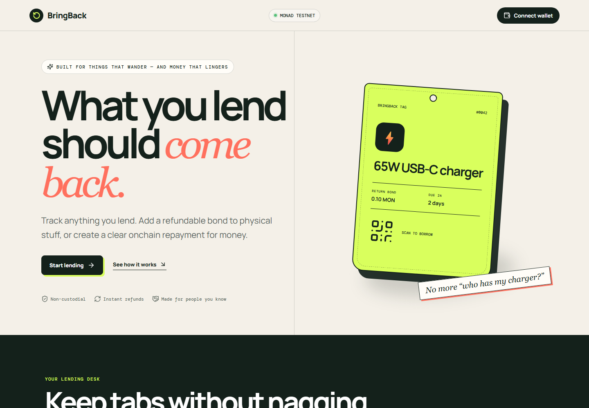
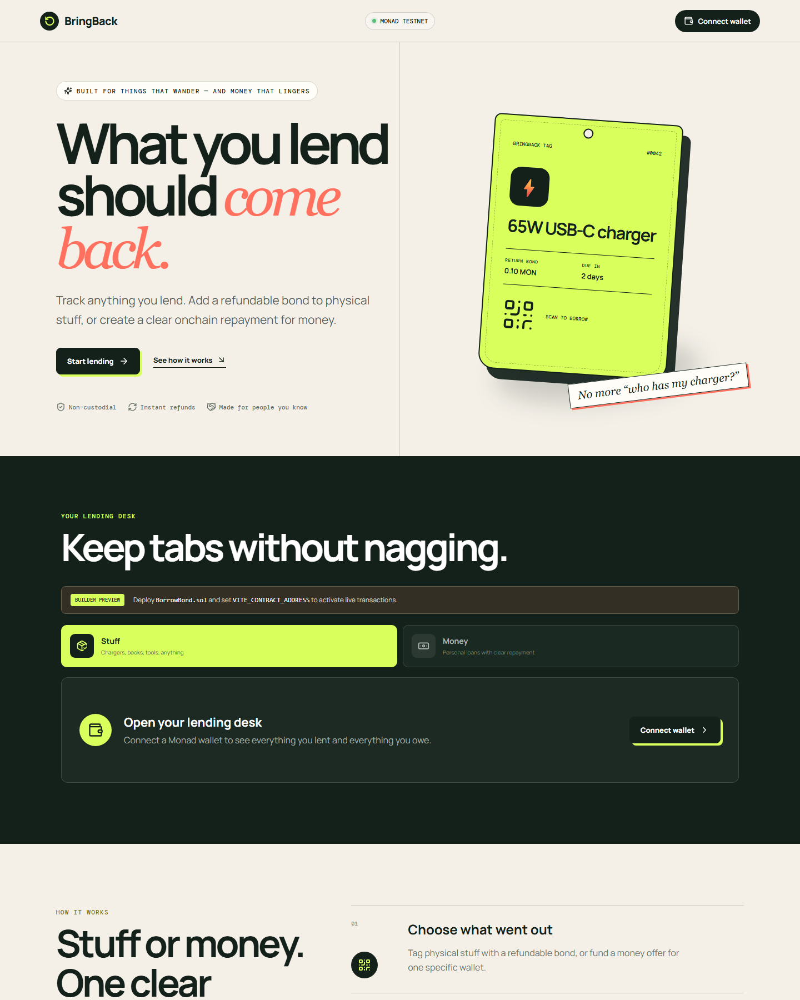
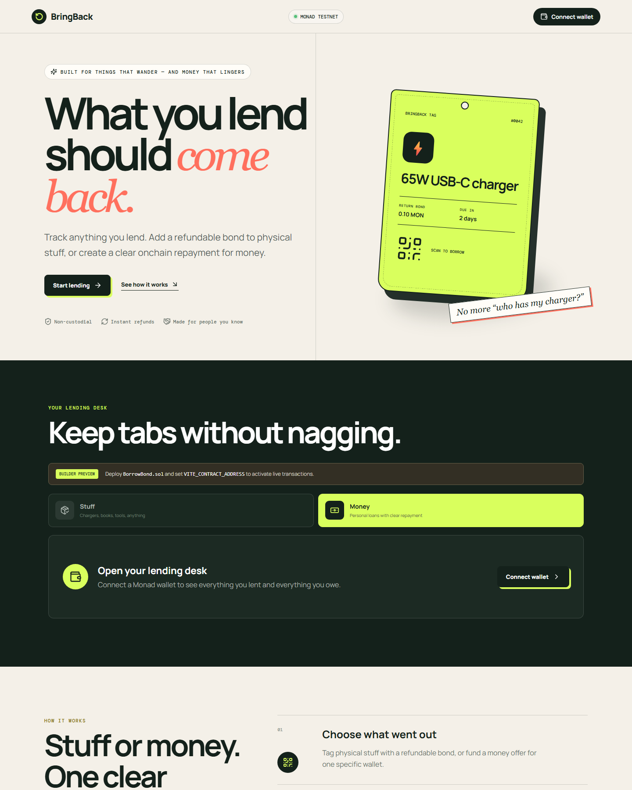
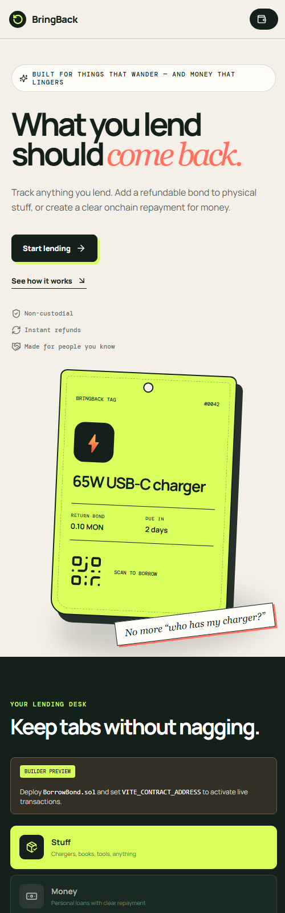

# BringBack

**What you lend should come back.**

[Live web app](https://bringback-ebon.vercel.app) | [GitHub repository](https://github.com/0xNexuz/bringback) | 

BringBack is an onchain lending desk for informal loans between people who already know each other. It handles two common situations without pretending they are the same problem:

- **Stuff** uses a refundable MON bond for physical items such as chargers, books, tools, clothes, controllers, and power banks.
- **Money** uses a funded, zero-interest offer that only one named wallet can accept and repay.

BringBack was built as a new solo project for the BuildAnything Spark hackathon on Monad.



## Why BringBack exists

Small personal loans are easy to make and awkward to follow up on. Friends forget who has an item, how much money was borrowed, or when it should come back. The lender either keeps sending reminders or quietly accepts the loss.

BringBack creates one shared, inspectable source of truth:

- who lent and who borrowed;
- what item or amount is involved;
- the agreed return window;
- whether the loan is available, active, overdue, repaid, returned, retired, or cancelled;
- where the MON is currently held.

The blockchain is used for custody and settlement, not decoration. The web interface reads live contract state and does not generate fake loan records.

## What is built

### Stuff mode

1. A lender registers an item name, return-bond amount, and loan duration.
2. BringBack produces a direct `/item/{id}` link and QR code.
3. A different wallet scans the tag and locks the exact MON bond.
4. The contract records the borrower and return deadline.
5. When the item comes back, the lender confirms the return and the contract refunds the borrower.
6. If the deadline has passed, the lender may claim the bond instead. Claiming retires the item.
7. A successfully returned item becomes available and can be lent again.

```text
AVAILABLE -> BORROWED -> AVAILABLE   (lender confirms return)
                      -> RETIRED     (lender claims overdue bond)

AVAILABLE -> RETIRED                 (lender manually retires tag)
```



### Money mode

1. A lender names a specific borrower wallet, enters a memo, amount, and repayment window.
2. The lender funds the offer with native MON when creating it.
3. The principal stays inside `BorrowBond` while the offer is waiting.
4. Only the named borrower can accept and receive the principal.
5. Acceptance starts the repayment deadline.
6. The borrower repays the exact principal directly through the contract to the original lender.
7. The borrower may still repay after the deadline; BringBack shows the loan as overdue until that happens.
8. The lender may cancel and recover an offer only before it has been accepted.

```text
OFFERED -> ACTIVE -> REPAID
        -> CANCELLED
```

There is intentionally no interest, liquidation, partial repayment, or tradable debt. This is a small personal-loan record, not a DeFi lending market.



## Why the contract matters

The contract enforces the parts that should not depend on the interface:

- item borrowers must lock the exact configured bond;
- lenders cannot borrow their own items;
- item refunds return directly to the recorded borrower;
- an overdue item bond can only be claimed by its lender;
- money offers are fully funded before they appear;
- only the named borrower can accept or repay a money loan;
- repayments must equal the original principal;
- only an unaccepted money offer can be cancelled;
- there is no owner, upgrade authority, admin withdrawal, or platform balance.

## Honest limitations

BringBack is an accountability tool for people who already know one another.

- A blockchain cannot verify whether a physical item was returned. The lender is the physical-return oracle.
- Stuff mode trusts the lender to confirm an honest return.
- Money loans are uncollateralized. The contract records an overdue debt but cannot force repayment.
- Only native MON is supported; ERC-20 tokens are not implemented.
- There are no push notifications, identity profiles, dispute judges, interest, late fees, partial payments, or loan transfers.
- The contract has automated tests but has not received a professional security audit. Bond and loan values should remain small.

## Contract interface

| Function | Caller | Effect |
|---|---|---|
| `createItem` | Lender | Registers an available physical item |
| `borrowItem` | Borrower | Locks the exact return bond and starts its deadline |
| `confirmReturn` | Lender | Refunds the bond and makes the item reusable |
| `claimOverdueBond` | Lender | Claims an overdue bond and retires the item |
| `retireItem` | Lender | Retires an available item |
| `createMoneyLoan` | Lender | Funds an offer for one named borrower |
| `acceptMoneyLoan` | Named borrower | Receives the principal and starts its deadline |
| `repayMoneyLoan` | Borrower | Repays the exact principal to the lender |
| `cancelMoneyLoan` | Lender | Recovers an offer that has not been accepted |

All native-MON payouts follow checks-effects-interactions and use a reentrancy guard. Failed transfers revert the entire state change.

## Web application

The React client implements:

- injected-wallet connection;
- Monad Testnet/Mainnet network switching and wallet network addition;
- Stuff and Money dashboard modes;
- lender and borrower views for both modes;
- live reads from `BorrowBond`;
- transaction submission and receipt waiting;
- explorer links for submitted transactions;
- responsive desktop and mobile layouts;
- QR codes and direct routes for physical-item borrowing;
- Vercel and Netlify SPA rewrites so direct item links resolve correctly.



## Repository structure

```text
contracts/BorrowBond.sol     Stuff and money loan state machine
test/BorrowBond.test.cjs     Nine Hardhat contract tests
scripts/deploy.cjs           Monad deployment script
src/App.tsx                  Wallet flows, dashboards, forms, and QR route
src/lib/contract.ts          Typed contract ABI and client data models
src/lib/chain.ts             Monad network and public client configuration
src/styles.css               Responsive visual system
DEMO_SCRIPT.md               Standalone sub-three-minute recording script
```

## Technology

- Solidity 0.8.28
- Hardhat, Ethers, and Chai
- React 18 and TypeScript
- Vite
- viem
- qrcode.react

## Verification

```bash
npm run contract:test
npm run typecheck
npm run build
```

The nine contract tests cover:

- item creation and lender indexing;
- exact item-bond custody;
- self-borrow and incorrect-bond rejection;
- borrower refunds and item reuse;
- overdue timing and lender authorization;
- invalid item input and retirement;
- funded money offers and designated-borrower acceptance;
- exact money repayment;
- cancellation of unaccepted money offers.

## Local development

Requirements: Node.js 20+ and an injected browser wallet such as MetaMask.

```bash
npm install
cp .env.example .env
npm run dev
```

Client configuration:

```dotenv
VITE_CONTRACT_ADDRESS=0xDEPLOYED_BORROW_BOND_ADDRESS
VITE_CHAIN_ID=10143
VITE_RPC_URL=https://rpc.testnet.monad.xyz
```

If `VITE_CONTRACT_ADDRESS` is absent, the site intentionally displays a builder-preview notice and disables live contract actions. It does not replace them with placeholder successes.

## Deploy the contract

Use a disposable development wallet and never commit or share its private key.

```powershell
$env:DEPLOYER_PRIVATE_KEY="0xYOUR_DISPOSABLE_DEVELOPMENT_KEY"
npm run contract:deploy:testnet
Remove-Item Env:DEPLOYER_PRIVATE_KEY
```

After deployment, set the public address as `VITE_CONTRACT_ADDRESS`, rerun the two-wallet flows, and redeploy the web client.

## Deployment status

| Component | Status |
|---|---|
| GitHub repository | Live: [`0xNexuz/bringback`](https://github.com/0xNexuz/bringback) |
| Vercel project | Live: [`bringback-ebon.vercel.app`](https://bringback-ebon.vercel.app) |
| Monad Testnet contract | Not deployed from this workspace yet |
| Monad Mainnet contract | Not deployed |

The hosted site is currently an honest builder preview: the interface and direct QR routes are deployed, but contract actions remain disabled until `VITE_CONTRACT_ADDRESS` is set to a public Monad deployment.


## License

MIT
